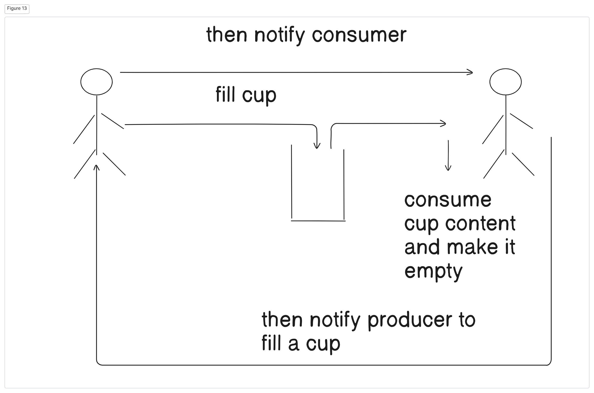

# Binary Semaphore in C++

## Overview
A **Binary Semaphore** is a synchronization primitive with two states: **locked** and **unlocked**. It is used to control access to a shared resource in a multi-threaded environment, ensuring that only one thread can access the resource at a time.

With the introduction of **C++20**, the `semaphore` header provides a standard way to work with semaphores, including binary semaphores, in a modern and safe manner.

---

## Features of Binary Semaphore
1. **Mutual Exclusion**: Ensures only one thread accesses a critical section at a time.
2. **Synchronization**: Allows threads to coordinate effectively.
3. **Binary Nature**: Holds two states: locked and unlocked, unlike counting semaphores.

---

## Example: Using `std::binary_semaphore`
The following example demonstrates the use of a **binary semaphore** to synchronize two threads:


---

## Explanation

1. **Semaphore Initialization**:
   ```cpp
   std::binary_semaphore semaphore(0);
   ```
   - Initializes the semaphore with a locked state (`0`).

2. **Producer**:
   - Simulates resource preparation.
   - Calls `semaphore.release()` to unlock the semaphore and notify the consumer.

3. **Consumer**:
   - Waits for the semaphore to be unlocked using `semaphore.acquire()`.
   - Proceeds to access the resource once unlocked.

---

## Use Cases
1. **Resource Access**: Ensures that a single shared resource (e.g., file or memory segment) is accessed by one thread at a time.
2. **Thread Synchronization**: Coordinates threads to ensure sequential execution of critical operations.

